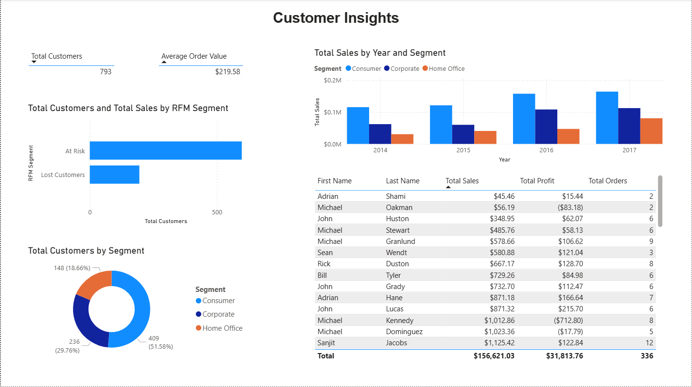
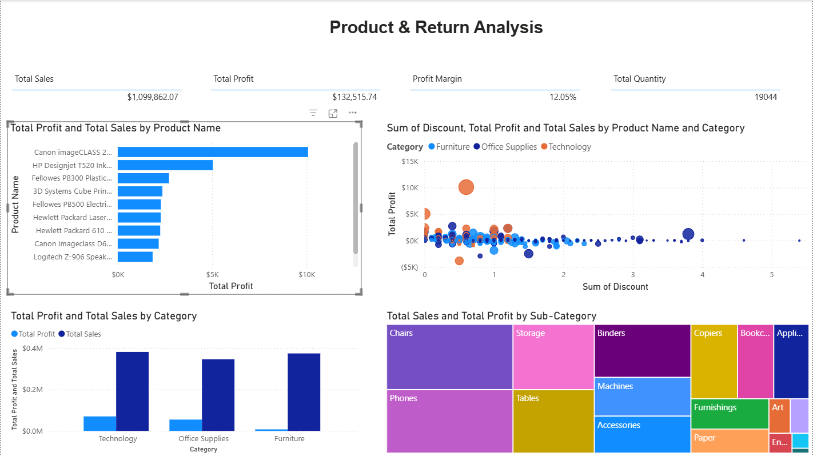
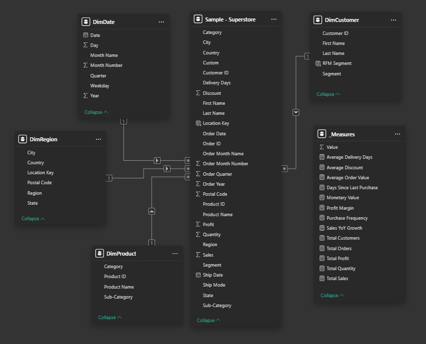

# 📊 Superstore Sales Dashboard - Power BI Project

## 🎯 Project Overview
A comprehensive business intelligence solution built in Power BI analyzing sales, customer behavior, and product performance for a retail superstore.

## 📁 Dataset
- **Source:** Superstore Sales Dataset (Kaggle)
- **Records:** 9,994 orders
- **Time Period:** 2014-2017
- **Data Points:** Sales, Profit, Discounts, Customer segments, Geographic data

## 🛠️ Skills Demonstrated

### 1. ETL & Data Cleaning (Power Query)
- Cleaned null values and standardized formats
- Split Customer Name into First/Last names
- Created calculated columns (Year, Month, Quarter, Delivery Days)
- Flagged profit outliers
- Removed duplicates

### 2. Data Modeling
- Built star schema with:
  - **1 Fact Table:** Sample - Superstore
  - **4 Dimension Tables:** DimCustomer, DimProduct, DimRegion, DimDate
- Established proper Many-to-One relationships
- Created separate measures table for DAX calculations

### 3. DAX Calculations
Created 10+ advanced measures including:
- Total Sales, Total Profit, Total Orders
- Profit Margin = `DIVIDE([Total Profit], [Total Sales])`
- Sales YoY Growth
- Average Delivery Days
- RFM Segmentation (Recency, Frequency, Monetary analysis)
- Customer segmentation logic

### 4. Interactive Dashboards

#### 📈 Page 1: Executive Summary
- KPI cards: Sales, Profit, Orders, Profit Margin
- Monthly/Yearly sales trends
- Geographic map visualization
- Sales by Segment and Category


#### 👥 Page 2: Customer Insights
- Top 10 customers analysis
- Customer segmentation over time
- RFM Analysis (Champions, Loyal, At Risk, Lost customers)



#### 📦 Page 3: Product Analysis
- Top 10 most profitable products
- Category performance comparison
- Discount vs Profit correlation analysis
- Sub-category treemap



#### 🗂️ Data Model
Star schema with proper relationships:



## 💡 Key Insights
- Technology category drives the highest sales (approximately $0.4M).
- Consumer segment contributes over 50% of total sales.
- Higher discount rates are strongly linked to lower or negative profit margins.
- A small group of loyal customers (RFM Champions) accounts for a significant share of revenue.
- West region leads in overall sales performance across all regions.
- Top 10 customers alone contribute a noticeably large portion of total revenue.

## 🔧 Tools & Technologies
- **Power BI Desktop**
- **Power Query (M language)**
- **DAX (Data Analysis Expressions)**
- **Data Modeling (Star Schema)**

## 📂 Repository Structure
```
├── superstore_dashboard.pbix    # Main Power BI file
├── screenshots/                  # Dashboard images
├── data/                         # Source data (optional)
└── README.md                     # Project documentation
```

## 🚀 How to Use
1. Download `superstore_dashboard.pbix`
2. Open with Power BI Desktop
3. Explore interactive dashboards
4. Filter by year, region, category, or segment

## 👤 Author
[Hasini Herath]
- LinkedIn: www.linkedin.com/in/hasini-herath-rhm
- Email: hasini.rhm@gmail.com

## 📅 Project Date
26 November 2025